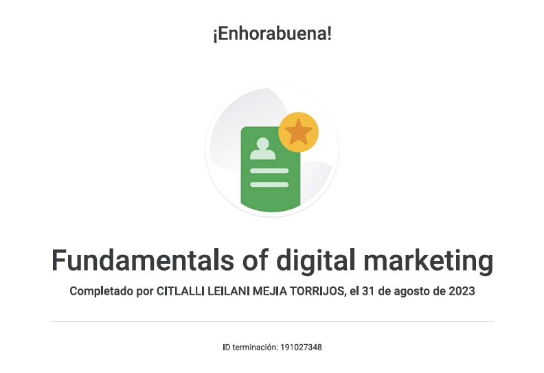
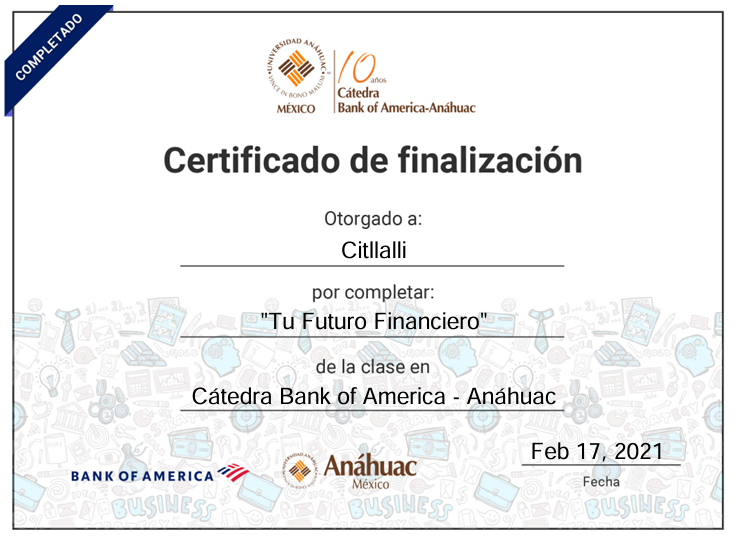

# Hola, soy Citlalli Leilani Mejía Torrijos 👋

## 💻 Ingeniera en Tecnologías de la Información

“Este espacio reúne los proyectos, investigaciones y aprendizajes que reflejan mi crecimiento profesional en el área de Tecnologías de la Información.”

## 🌟 Sobre mí

Me apasiona transformar ideas en soluciones tecnológicas mediante el análisis, la gestión de proyectos y el desarrollo de productos digitales.

Actualmente estoy fortaleciendo y mejorando los conocimientos que he adquirido, con el objetivo de desarrollar una visión más amplia que me permita destacar y convertirme en una mejor candidata profesional.

## 🎯 Áreas de interés

📊 Product Management

📋 Gestión de Proyectos

🤖 Inteligencia Artificial

📈 Business Analysis

📂 Gestión Documental

## 🛠️ Tecnologías y conocimientos

Python

Machine Learning

Redes Neuronales

Procesamiento de Lenguaje Natural (PLN)

Analítica de Datos

Git y GitHub

Scrum

Excel

SQL (en mejora continua)

## 📜 Certificaciones

  
<b>📜 CCNA v7: Introducción a Redes — Cisco Networking Academy</b> (Clic para ver certificado)

   
  

  
<b>📜 Fundamentals of Digital Marketing — Google</b> (Clic para ver certificado)

   
  

  
<b>📜 Importancia del Financiamiento — Nacional Financiera (NAFIN)</b> (Clic para ver certificado)

   
  

  
<b>📜 Tu Futuro Financiero — Bank of America / Cátedra Anáhuac</b> (Clic para ver certificado)

   
  

## 🌱 Actualmente

Fortaleciendo y mejorando mis conocimientos técnicos.

Construyendo proyectos para desarrollar una visión integral de producto y tecnología.

✨ Gracias por visitar mi perfil.
